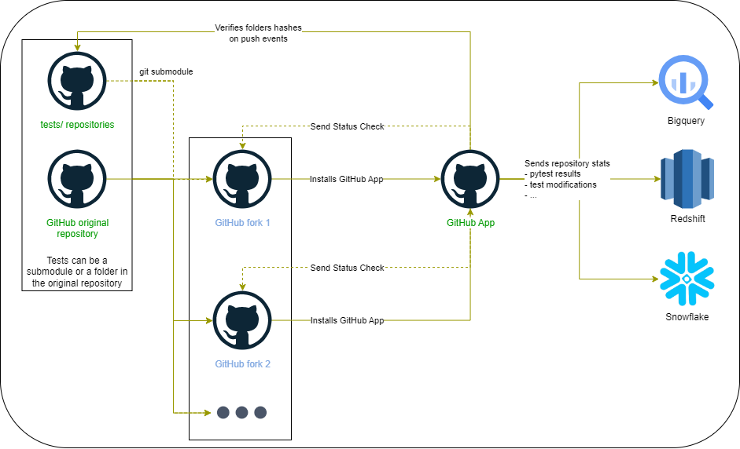

# github_tests_validator_app

<div align="center">

[](https://github.com/artefactory/github_tests_validator_app/actions/workflows/ci.yml?query=branch%3Amain)
[](https://github.com/artefactory/github_tests_validator_app/actions/workflows/cd.yml?query=event%3Arelease)
[](#supported-python-versions)
[](https://github.com/artefactory/github_tests_validator_app}/pulls?utf8=%E2%9C%93&q=is%3Apr%20author%3Aapp%2Fdependabot)

[](https://github.com/artefactory/github_tests_validator_app/releases)


`github_tests_validator_app` is a GitHub Application you can deploy on your own to retrieve test results from forked projects.

Here is how it works :



The main purpose of this project is for education.

Often, Computer Science teachers can have a main repository and ask their students to fork their repository to complete the courses from their repository.

Students never merge their repository into the main one, so it can be tedious for teachers to retrieve informations about the results from their exercices.

By deploying a GitHub App and asking their students to install this app on their GitHub forked projects, teachers can retrieve automatically the results from their tests (using [pytest](https://docs.pytest.org/en/7.1.x/)) into Google Sheets.

</div>

## Prerequisites

1) You need to [create a GitHub App](https://docs.github.com/en/developers/apps/building-github-apps/creating-a-github-app) in your organization or personal account on GitHub
2) For GCP cloud run deployment, you may need to install terraform and the gcloud CLI.

## Deploy locally

You first need to create a `.env` file by filling up the values from the `.env.template` file.
More details about each of these values [below](#environment-variables-details).

You can start the GitHub App backend locally with the following command :

```bash
docker run -d --rm -p 127.0.0.1:8080:8080 --env-file .env ghcr.io/artefactory/github_tests_validator_app:latest
```

Then you can use [smee.io](https://smee.io/) or [ngrok](https://ngrok.com/) to serve your applications running locally.

## Deploy in the cloud

With Cloud Run, you have an example terraform configuration [here](https://github.com/artefactory/github_tests_validator_app/blob/main/examples/cloud_run/).

But you can deploy the application on many Serverless Container services on any cloud by making sure that :
- The secrets defined in the `.env` file are available for the container at runtime as environment variables
- The container can receive HTTP requests
- The container can use a GCP service account to login with the [Python Google Auth client](https://google-auth.readthedocs.io/en/master/)
- The service account is linked to a GCP Project which has the Google Drive API enabled

## Environment variables details

- GH_APP_ID : Auto-generated ID of the GitHub App you created during the [`Prerequisites`](#prerequisites) step.
- GH_APP_KEY : Private Key of the GitHub App you created during the [`Prerequisites`](#prerequisites) step.
- GH_PAT : GitHub personal access token [you must create](https://docs.github.com/en/authentication/keeping-your-account-and-data-secure/creating-a-personal-access-token) that has access to the GitHub repository containing the tests and the original repository which was forked (both could be the same repository).
- GDRIVE_MAIN_DIRECTORY_NAME : Name of the Google Drive Folder where you want the stats to be sent.
- USER_SHARE : Comma-separated list of emails that have access to this Google Drive Folder.
- LOGGING : "LOCAL" if you are deploying locally, "GCP" if you are deploying on Google Cloud Run.
- GH_TESTS_REPO_NAME : (Optional, only if you are using a git submodule for the tests folder) Name of the repository containing the tests (could be convenient if you have a repository with the exercices, and another one with the solutions and you want to have the same tests in both repositories by providing a submodule defined in a third repository).

## Contributing

Check the guide here : [CONTRIBUTING](https://github.com/artefactory/github_tests_validator_app/blob/main/CONTRIBUTING.md)

### Makefile usage

[`Makefile`](https://github.com/artefactory/github_tests_validator_app/blob/main/Makefile) contains many functions for fast assembling and convenient work.

<details>
<summary>1. Download Poetry</summary>
<p>

```bash
make download-poetry; export PATH="$HOME/.local/bin:$PATH"
```

</p>
</details>

<details>
<summary>2. Install all dependencies and pre-commit hooks</summary>
<p>

```bash
make install
```

If you do not want to install pre-commit hooks, run the command with the NO_PRE_COMMIT flag:

```bash
make install NO_PRE_COMMIT=1
```

</p>
</details>

<details>
<summary>3. Check the security of your code</summary>
<p>

```bash
make check-safety
```

This command launches a `Poetry` and `Pip` integrity check as well as identifies security issues with `Safety` and `Bandit`. By default, the build will crash if any of the items fail. But you can set `STRICT=0` for the entire build, and then you can configure strictness for each item separately.

```bash
make check-safety STRICT=0
```

or only for `safety`:

```bash
make check-safety STRICT=0 SAFETY_STRICT=1
```

multiple

```bash
make check-safety STRICT=0 PIP_STRICT=1 SAFETY_STRICT=1
```

> List of flags for `check-safety` (can be set to `1` or `0`): `STRICT`, `POETRY_STRICT`, `PIP_STRICT`, `SAFETY_STRICT`, `BANDIT_STRICT`.

</p>
</details>

<details>
<summary>4. Check the codestyle</summary>
<p>

The command is similar to `check-safety` but to check the code style, obviously. It uses `Black`, `Darglint`, `Isort`, and `Mypy` inside.

```bash
make check-style
```

It may also contain the `STRICT` flag.

```bash
make check-style STRICT=0
```

> List of flags for `check-style` (can be set to `1` or `0`): `STRICT`, `BLACK_STRICT`, `DARGLINT_STRICT`, `ISORT_STRICT`, `MYPY_STRICT`.

</p>
</details>

<details>
<summary>5. Run all the codestyle formatters</summary>
<p>

Codestyle uses `pre-commit` hooks, so ensure you've run `make install` before.

```bash
make format-code
```

</p>
</details>

<details>
<summary>6. Run tests</summary>
<p>

```bash
make test
```

</p>
</details>

<details>
<summary>7. Run all the linters</summary>
<p>

```bash
make lint
```

the same as:

```bash
make test && make check-safety && make check-style
```

> List of flags for `lint` (can be set to `1` or `0`): `STRICT`, `POETRY_STRICT`, `PIP_STRICT`, `SAFETY_STRICT`, `BANDIT_STRICT`, `BLACK_STRICT`, `DARGLINT_STRICT`, `PYUPGRADE_STRICT`, `ISORT_STRICT`, `MYPY_STRICT`.

</p>
</details>

<details>
<summary>8. Build docker</summary>
<p>

```bash
make docker
```

which is equivalent to:

```bash
make docker VERSION=latest
```

More information [here](https://github.com/artefactory/github_tests_validator_app}/tree/main/docker).

</p>
</details>

<details>
<summary>9. Cleanup docker</summary>
<p>

```bash
make clean_docker
```

or to remove all build

```bash
make clean
```

More information [here](https://github.com/artefactory/github_tests_validator_app}/tree/main/docker).

</p>
</details>


<details>
<summary>10. Activate virtualenv</summary>
<p>

```bash
poetry shell
```

To deactivate the virtual environment :

```bash
deactivate
```

</p>
</details>

<details>
<summary>11. Deploy on GCP</summary>
<p>

```bash
make deploy_gcp
```

</p>
</details>
